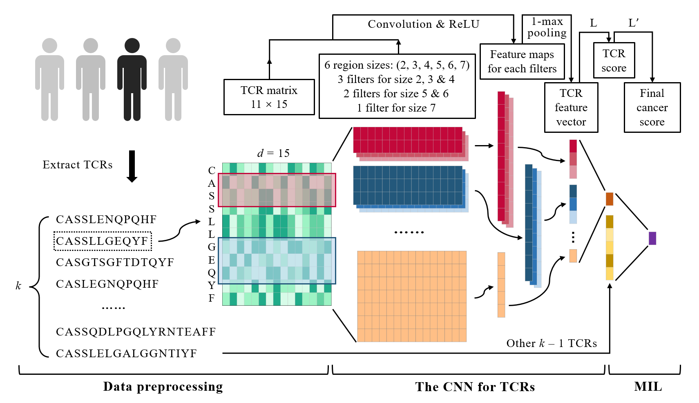

# DeepLION 

Deep MuLti-Instance Learning Improves the Prediction of Cancer-associated T Cell ReceptOrs for Accurate CaNcer Detection
------------------------------

DeepLION is a deep multi-instance learning (MIL) method for identifying cancer-associated T cell receptors (TCRs) and detecting cancer samples using TCR-sequencing data. Its workflow is divided into three parts: data preprocessing, the convolutional neural network (CNN) for TCRs, and MIL. For more details, please read our paper `DeepLION: Deep MuLti-Instance Learning Improves the Prediction of Cancer-associated T Cell ReceptOrs for Accurate CaNcer Detection`.

<p float="left">
  
</p>


## Content

<!-- @import "[TOC]" {cmd="toc" depthFrom=1 depthTo=6 orderedList=false} -->

<!-- code_chunk_output -->

- [Project Organization](#project-organization)
- [Usage](#usage)
  - [Python package versions](#python-package-versions)
  - [Making predictions using the pre-trained model](#making-predictions-using-the-pre-trained-model)
  - [Training DeepLION models](#training-models)
- [Citation](#citation)
- [Contacts](#contacts)


<!-- /code_chunk_output -->


## Project Organization

    ├── LICENSE                     <- Non-commercial license.
    │     
    ├── README.md                   <- The top-level README for users using DeepLION.
    │ 
    ├── Codes                       <- Python scripts of DeepLION. See README for their usages.
    │   ├── DeepLION_prediction.py  <- Making predictions using pre-trained DeepLION models.
    │   ├── DeepLION_training.py    <- Training DeepLION models.
    │   ├── Evaluation.py           <- Evaluating the performances of DeepLION.
    │   └── ProcessRawFiles.py      <- Processing raw TCR-sequencing data files.
    │ 
    ├── Data                        <- Data used in DeepLION. See README in this folder for more details.
    │   ├── Lung
    │   │   ├── TestData
    │   │   ├── TrainingData
    │   │   └── README.md
    │   │ 
    │   ├── THCA
    │   │   ├── TestData
    │   │   ├── TrainingData
    │   │   └── README.md
    │   │     
    │   ├── TrainingSequences
    │   │   ├── NormalCDR3.txt
    │   │   ├── NormalCDR3_test.txt
    │   │   ├── README.md
    │   │   ├── TumorCDR3.txt
    │   │   └── TumorCDR3_test.txt
    │   │     
    │   ├── AAidx_PCA.txt
    │   ├── Example_raw_file.tsv
    │   ├── README.md
    │   └── Reference_dataset.tsv
    │
    ├── Figures                     <- Figures used in README.
    │   ├── DeepLION_workflow.png
    │   └── Lion.png
    │  
    ├── Models                      <- Pre-trained DeepLION models for users making predictions directly.                             
    │   ├── Pretrained_Lung.pth 
    │   └── Pretrained_THCA.pth
    │      
    └── Results                     <- Some results of using DeepLION.
        ├── Example.tsv             <- The result file after processing `Example_raw_file.tsv`.
        ├── Lung_prediction.tsv     <- Prediction results on lung cancer test data using the corresponding pre-trained model.
        └── THCA_prediction.tsv     <- Prediction results on thyroid cancer test data using the corresponding pre-trained model.

## Usage

### Python package versions

DeepLION works perfectly in the following versions of the Python packages:

```
Python          3.7.2
numpy           1.21.2
torch           1.6.0+cpu
scikit-learn    0.23.2
```

### Making predictions using the pre-trained model

Users can use the pre-trained models we provided in `./Models/Pretrained/` to make predictions directly.

First, we need to collect the raw TCR-sequencing data files, such as `./Data/Example_raw_file.tsv`, and use the Python script `./Codes/ProcessRawFiles.py` to process them by this command:

```
python ./Codes/ProcessRawFiles.py --input ./Data/Example_raw_file.tsv --reference ./Data/Reference_dataset.tsv --output ./Results/Example.tsv
```

After processing, the low-quality TCR beta chain CDR3 sequences and the sequences appearing in the reference dataset are removed. The top *k* (`default: 100`) TCR sequences and their abundances are saved in `./Results/Example.tsv`:

```
TCR	Abundance
CASSLTRLGVYGYTF	0.06351
CASSKREIHPTQYF	0.043778
CASSLEGGAAMGEKLFF	0.039882
CASSPPDRGAFF	0.034422
CASSTGTAQYF	0.028211
CASSEALQNYGYTF	0.027918
CSARADRGQGYEQYF	0.027427
CASSPWAATNEKLFF	0.023224
CAWGWTGGTYEQYF	0.019363
······
```

If users get raw files in different format, they can also apply this script by setting the argument `--info_index` (`default: [-3. 2]`) to the indexes of CDR3 sequences and their clone fractions in their files.

Then, we use the Python script `./Codes/DeepLION_prediction.py` to make predictions on processed data files in `./Data/THCA/TestData/` using the pre-trained model `./Models/Pretrained_THCA.pth` by this command:

```
python ./Codes/DeepLION_prediction.py --sample_dir ./Data/THCA/TestData/ --model_file ./Models/Pretrained_THCA.pth --aa_file ./Data/AAidx_PCA.txt --output ./Results/THCA_prediction.tsv
```

The prediction results, including sample filenames, probabilities of being cancer-associated, and cancer predictions, are saved in `./Results/THCA_prediction.tsv`:


```
Sample	Probability	Prediction
Health_001.tsv	0.2733137767311635	False
Health_002.tsv	0.11589630679459391	False
Health_003.tsv	0.0023036408351775795	False
Health_004.tsv	0.04514491246460731	False
Health_005.tsv	0.03503014357993675	False
Health_006.tsv	0.0008458254917743452	False
Health_007.tsv	0.26301584490197166	False
Health_008.tsv	0.04840260793287661	False
Health_009.tsv	0.00024520156538897236	False
······
```

Finally, we can use the Python script `./Codes/Evaluation.py` to evaluate the performance of DeepLION on these test data by this command:

```
python ./Codes/Evaluation.py --input ./Results/THCA_prediction.tsv
```

The metrics, accuracy, sensitivity, specificity, and area under the receiver operating characteristic (ROC) curve (AUC), are calculated and printed as: 

```
----- [./Results/THCA_prediction.tsv] -----
        Accuracy:       0.884
        Sensitivity:    0.8
        Specificity:    0.957
        AUC:    0.956
```

### Training DeepLION models

Users can use the Python script `./Codes/DeepLION_training.py` to train their own DeepLION models on their TCR-sequencing data samples for a better prediction performance by this command:

```
python ./Codes/DeepLION_training.py --sample_dir ./Data/THCA/TrainingData/ --aa_file ./Data/AAidx_PCA.txt --dropout 0.4 --epoch 1000 --learning_rate 0.001 --output ./Models/Pretrained_THCA.pth
```

## Citation

When using our results or modelling approach in a publication, please cite our paper ([https://doi.org/10.3389/fgene.2022.860510](https://doi.org/10.3389/fgene.2022.860510)):

>Xu, Y., Qian, X., Zhang, X., Lai, X., Liu, Y. and Wang, J. (2022). DeepLION: Deep Multi-Instance Learning Improves the Prediction of Cancer-associated T Cell ReceptOrs for Accurate CaNcer Detection. Front. Genet. doi: 10.3389/fgene.2022.860510.

## Contacts

DeepLION is actively maintained by Xinyang Qian, currently a Ph.D student at Xi'an Jiaotong University in the research group of Prof. Jiayin Wang.

If you have any questions, please contact us by e-mail: qianxy@stu.xjtu.edu.cn.
